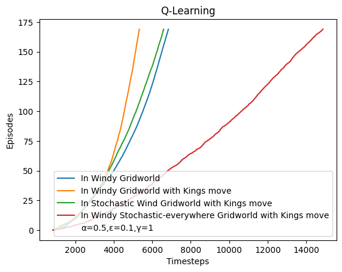

# CS747-Reinforcement-Learning
These are my submissions for programming assignments for IIT Bombay Course [CS747](https://www.cse.iitb.ac.in/~shivaram/teaching/old/cs747-a2020/index.html) - Reinforcement Learning and Course [CS748](https://www.cse.iitb.ac.in/~shivaram/teaching/cs748-s2021/index.html) - Advanced Reinforcement Learning 

## CS747 - assignment 3 and CS748 quiz 4
Implemments several RL algorithms in windy gridworld. 

### Modules

- `environments.py` contains following classes:

    | Class name                                      | Stochastic            | Kings move |
    |-------------------------------------------------|-----------------------|------------|
    | WindyGridWorld                                  | No                    | No         |
    | WindyGridWorldKingsMove                         | No                    | Yes        |
    | WindyStochasticEverywhereGridWorldWithKingsMove | In all columns        | Yes        |
    | StochasticWindGridWorldWithKingsMove            | Only in windy columns | Yes        |

- Following modules implement various corresponding algorithms:
  - `sarsa.py` implements Sarsa algorithm
  - `expected_sarsa.py` implements Expected Sarsa algorithm
  - `qlearning.py` implements Q learning algorithm
  - `dynaq_stoch.py` implement stochastic DynaQ algorithm
- `multirun.py` has logic to run above algorithms on different gridworlds and generate below graphs

### Important observations
- Expected Sarsa is most affected by stochastic noise as it takes almost double times steps for Type 4 grid world (stochastic noise in all columns). This might be because of Expected Sarsa’s stochastic (wighted) approach to calculate target value: $$Target = r_t+\gamma\sum_{a\in A}\color{red}{\pi^t(s^{t+1},a)}\hat{Q}(s^{t+1},a)$$ Other algorithms does not seem to get affected as much as Expected Sarsa dur to stochastic noise. Thus Expected Sarsa is worst for stochastic environments.
- Surprisingly, Sarsa and Q Learning performs better with stochastic noise only in windy columns (with Kings move) than without any stochastic noise (with no Kings move). Thus, Kings moves help these two algorithms overcome performance impact of stochastic noise in windy columns. Expected Sarsa continues to perform poor with stochastic noise even in just windy columns (possibly due to same reason explained in above point).

### Graphs
- Algorithms in Non stochastic Windy Gridworld without Kings move  
  
- Alogrithms in Non stochastic Windy Gridworld with Kings move  
  
- Algorithms in Stochastic-Everywhere Windy Gridworld with Kings move  
  
- Algorithms in Stochastic Windy Gridworld with Kings move (including stochastic DynaQ algorithm)  
  
- ExpectedSarsa in different grid worlds  
  
- Q-learning in different grid worlds  
  

